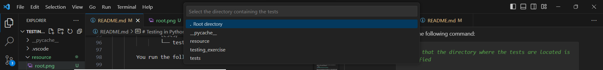
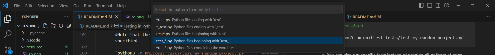

# Testing in Python

**Instructions:**

1. Fork this repository to your own Github account.
2. Clone the forked repository to your local machine.
3. After completing each exercise: git add, git commit, and git push to your forked repository.

## Table of Contents

1. [Unittest Framework](#unittesting-framework)
2. [Unit Testing](#unit-testing)
2. [Test Documentation](#test-documentation)


## Unittest Framework

To accomplish the objective of creating tests, our preferred approach is to utilise the PyUnit (unittest) framework.
There are different frameworks/methods we can use to achieve this, but let's just stick to this specific one for now. :smile:

**What are frameworks? A framework is a pre-built set of tools, libraries, conventions, and best practices that provides a foundation for building applications by offering a reusable and standardized structure, often including components for common tasks (We'll go into detial on this at a later time)**

Where should you begin? Begin by importing the framework into your test module.

```python
import unittest
```

This will ensure that you have access to the necessary tools and functionalities provided by the framework for effectively writing and executing tests in your module

Make sure to import the python file/module you're working on.

```python

import unittest

import some_file_im_working_on

```

The next step is to define a your own test class and have it inherit from 'unittest.TestCase'.

```python
class myTestClass(unittest.TestCase):
```

What does this mean? Don't worry about it :) We'll get more into this in your second semester when you learn about Object Oriented Programming (OOP).

For now, just know that this allows you to define individual test methods inside the class, making it organised and easy to run tests using the unittest framework in Python.

You can go ahead and write your tests now. Here are a few ground rules for when you write your tests:

1. Naming convention: 
    
    Stick to a strict naming convention. A consistent naming convention enhances the overall readability and maintainability of the codebase.
    It'll also allow some IDEs (Integrated Development Environment) to be able to recognise your tests

    ```python
    import unittest

    import some_file_im_working_on

    class myTestClass(unittest.TestCase):

        def test_what_the_test_does(self): #Mind the indentation
    ```

2. Documentation:

    Add comments or docstrings to explain the purpose and expected behavior of the test. This makes it easier for other developers to understand the intent of the test.

**How To Run You Tests**

There are different ways to run your tests. Let's explore a few of our options

1. Via Terminal

    You can invoke the tests via the terminal by running the following command. Make sure that you're in the root directory of your project.

    - If your project stucture is as follows:

            Project root/   
            ├── my_random_project.py    
            │   
            └── test_my_random_project.py
            
        You run the following command: 
        ```bash
        `python3 -m unittest test_my_random_project.py`
        ```

    - If you project structure if as follows:

            Project root/   
            ├── my_random_project.py    
            │   
            └── tests/
                └── test_my_random_project.py

        You run the following command:

        ```bash
        #Note that the directory where the tests are located is specified

        `python3 -m unittest tests/test_my_random_project.py` 
        ```

    - You can also run specific tests instead of running all of them at once.

2. Via VSCode IDE

    You will need to setup your PC.

    - On VSCode, Click: ctrl + shift + p 

        You should get the following dropdowns.

        

    - Search and click on 'Python: Configure Tests'

        You should get the following dropdown
        

    - Click on unittest (Specifying which framework you'll be using for testing)

        You should get the following dropdown
        

        Here, you are specifying the directory of the tests you wish to run.

    - Click on the directory of your choice, in this case, we click on 'tests'

        You should get the following dropdown
        

        This is where sticking to a uniform naming convention

        Our chosen naming convention is:

        ```python
        def test_user_understands_TDD(self):
        ``` 
        So we click on the highlighted option. (test_*.py)

        If our chosen naming convention was:

        ```python
        def user_undertsands_TDD_test(self):
        ```
        We would click on the second option on the dropdown (*_test.py)


    - You are now done with setting up. Click on the flask icon on you left.
    .png>)

    Your tests will now appear in the following manner. Code away!

    


    


## Unit Testing

**What is Unit Testing?**

Unit testing is a software testing technique where UNDIVUDUAL UNITS or components of a program are tested in isolation to ensure their correctness. The goal is to verify that each unit of the software performs as designed. A unit in this context is the smallest testable part of an application, typically a function or method. 

How do we go about writing these tests?

**TDD - Test Driven Development**

TDD is a set of programming practices whereby we write another program to test our program. The test program consists of lots of small functions that test every bit of functionality of the main program. We use TDD to gradually evolve a program whilst ensuring that it is functioning as expected.


**Why TDD is important?**

- It creates a safety net when we change code

- It gives us confidence that our programs work as expected

- It is a technique that helps us evolve a design in SMALL STEPS and encourages better design

- It encourages us to write just the right amount of code to solve a problem


**The TDD Cycle/Process**

The TDD lifecycle is known as the <font color='red'>RED</font>-<font color='GREEN'>GREEN</font>-<font color='ORANGE'>REFACTOR</font> cycle.

Let's explore this further.

**<font color='red'>RED</font>**

We start by writing a failing test.

**<font color='GREEN'>GREEN</font>**

Write the minimum code necessary to make the failing test pass.

**<font color='ORANGE'>GREEN</font>**

Refactor the code while keeping it functional. Ensure that the code remains clean, maintainable, and follows best practices.

The Red-Green-Refactor cycle is iterative, and developers repeat this cycle multiple times during the development process.


*Let's explore some testing techniques*

1. FAKE IT

    Faking is a technique where we hard code values to get a test to fail, then pass. Finally we replace the hard-coded values with our actual code.

    - RED Remember we start with a failing test

        When starting to write a new test, fake the implementation of the function with hardcoded values.

        ```python
        import unittest

        def add(i, j):
            return 0                                

        class FakeItExample(unittest.TestCase):

        def test_sum_two_numbers(self):
            self.assertEqual(add(1,2), 3)   
        ```

    - GREEN Now to get to green using a fake

        Now change the hardcoded failing value with a hardcoded expected value. This seems counter-intuitive but it exists to confirm that your function does work for as expect for that faked value.


        ```python
        import unittest

        def add(i, j):
            return 3                                

        class FakeItExample(unittest.TestCase):

        def test_sum_two_numbers(self):
            self.assertEqual(add(1,2), 3)  
        ```

    - REFACTOR Time to refactor

        We can replace the fake value with the actual code to make the test work.

        Remember to leave the test alone and change the function to get rid of the fake

        ```python
        import unittest

        def add(i, j):
            return i + j                                

        class FakeItExample(unittest.TestCase):

        def test_sum_two_numbers(self):
            self.assertEqual(add(1,2), 3)
        ```

    **NOTE: Don’t keep your fake values for longer than a couple of tests. The longer you keep the fakes around, the longer you will take to get to the actual code. Worse, you will get yourself in a horrible knot. If you don’t know how to get rid of the fake, then it is very likely that you need to understand the problem a bit more.**


2. Tests List

    1. When you start a programming cycle, make a list of the tests you need think you need.

    2. Write it down! — in any order.

    3. Then pick one test — often it is the test that is least scary to write.

    4. Try to write the test and get it to pass.

    5. If you can’t get it to pass, leave to once side and pick another test from your list.

    6. Once you complete a test, review your test list — strike off irrelevant tests, add on new tests

    7. If you are in a middle of a test and discover that you need another test, just add it too your test list

```python
#Let's put it into practice

import unittest

def reverse(s):       # this function must return the reverse of string `s`
    pass                             # replace this code with your own code

class ReverseString(unittest.TestCase):

    def test_reverse(self):
        self.fail('Test not implemented yet') # replace this code with your own code
```

STEP1: Let's create our own test list:

1. Reverse empty string should return empty string

2. Reverse abcde should return edcba

3. Reverse None

4. Reverse single character string a should be a

5. Reverse repeated character string aaa should be aaa

STEP2: RED - Write a failing test with a fake

```python
import unittest

def reverse(s):
    return ""                                           

class ReverseString(unittest.TestCase):

    def test_reverse(self):
        self.assertEqual(reverse("hello"), "olleh") 
```

STEP3: GREEN - Make it pass with a fake

```python
import unittest

def reverse(s):
    return "olleh"                                      

class ReverseString(unittest.TestCase):

    def test_reverse(self):
        self.assertEqual(reverse("hello"), "olleh")
```


STEP4: REFACTOR - remove the fake

```python
import unittest

def reverse(s:str):
    return s                                     

class ReverseString(unittest.TestCase):

    def test_reverse(self):
        self.assertEqual(reverse("hello"), "olleh")   
```

## Types Of Tests

In your journey so far you've been exposed to different types of tests, more specifically:

1. Unit testing

2. Integration testing

There are other types of tests, but let's stick to these two for now.

**Know the difference**

| Feature                | Unit Testing                                   | Integration Testing                             |
|------------------------|------------------------------------------------|--------------------------------------------------|
| **Scope**              | Focused on individual units or components.     | Concerned with interactions between components. |
| **Purpose**            | Identifies defects within isolated units.      | Verifies collaboration and data flow between units. |
| **Example**            | Testing a function, method, or class in isolation. | Testing the end-to-end interaction of the program. |


## Test Documentation


Test documentation plays a crucial role in the software development lifecycle by providing information about the testing process, test cases, and their outcomes.

**Why you should document your tests:**

Communication: Test documentation serves as a means of communication among team members, including developers, testers, and other stakeholders.

Verification: It verifies that the software behaves as expected and meets specified requirements.


By following this order, you will develop the skills to write and conduct tests effectively for your Python projects. Make sure to commit your changes and push them to your forked repository after completing each exercise. Enjoy the learning experience!

